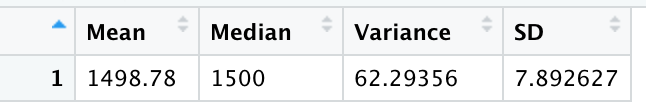

# MechaCar_Statistical_Analysis

## Linear Regression to Predict MPG

When using a linear regression function on the MechaCar prototype dataset, the variables that provided a non-random amount of variance to the mpg values are vehicle_length and ground_clearance. The slope of the linear model would not be zero for these two variables as because they are significant so there is sufficient evidence to reject our null hypothesis, which means that the slope of our linear model is not zero. This linear model does predict mpg of MechaCar prototypes effectively as the r-value is .68 despite the number of  significant variables. We do need to keep in mind that it is a small dataset of only 50 prototypes and may be evidence of overfitting.
  
## Summary Statistics on Suspension Coils

The design specifications for the MechaCar suspension coils dictate that the variance of the suspension coils must not exceed 100 pounds per square inch. The current manufacturing data does meet this design specification for the manufacturing lots in total. When looking at the lots, Lot 1 and Lot 2 are both within the design specifications. Lot 3 shows the most variance.

## T-Tests on Suspension Coils

For Manufacturing Lot 1 and Lot 2 the PSI values are not different from the population mean, as seen by the p-value that is greater than 0.05. But Lot 3 has a p-value of 0.04168 which means there is sufficient evidence to reject the null hypothesis and say that the true mean of this lot is not equal to 1500. 

## Study Design: MechaCar vs Competition
Consumers look at multiple factors to make a decision on what kind of car to purchase. A metric that can be tested is maintenance cost and whether it is an important factor in a purchase decision. The alternative hypothesis is the higher the maintenance cost of a vehicle, the less likely a consumer will purchase the vehicle. The statistical test that would be used is a linear regression test. The data that would be needed is the maintenance cost of a vehicle and the number of vehicles purchased.
